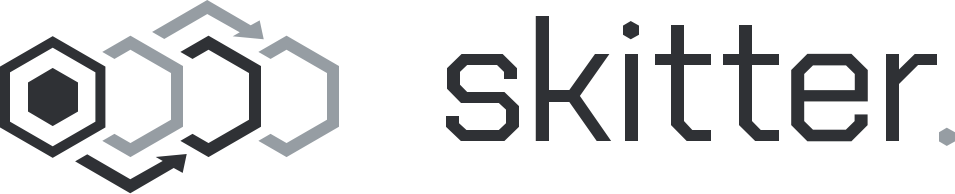

A domain specific language for building horizontally scalable, reactive
workflow applications with custom distribution strategies.

Built in the context of my PhD at the
[Software Languages Lab](https://soft.vub.ac.be/).

# Skitter

Skitter is a reactive workflow system; it makes it possible to define data
processing pipelines which respond to incoming data automatically by combining
_components_ into a _workflow_.

A key difference between Skitter and other, related, technologies is the notion
of a _distribution strategy_; components in a Skitter application specify a
strategy which defines how the component is distributed over a cluster at
runtime.
Strategies can be implemented from scratch or built based on existing
strategies.

More information about Skitter can be found at:
https://soft.vub.ac.be/~mathsaey/skitter.

## Status

__This version of skitter is a work in progress. It is currently not usable.__
Information on using the earlier, effect based, version on Skitter can be found
[here](https://soft.vub.ac.be/~mathsaey/skitter/docs/v0.1.1/).

# Getting started

Coming soon.
