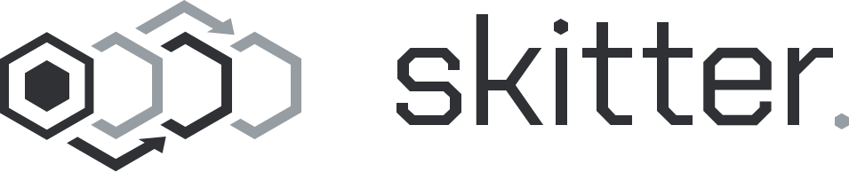

[ [Homepage](https://soft.vub.ac.be/~mathsaey/skitter/) ]
[ [Documentation](https://hexdocs.pm/skitter/) ]

A domain specific language for building scalable, distributed stream processing
applications with custom distribution strategies.

Built in the context of my PhD at the
[Software Languages Lab](https://soft.vub.ac.be/).

# Skitter

Skitter is a distributed stream processing system: it makes it possible to
define data processing pipelines by combining data processing steps called
_operations_ into a _workflow_.

A key difference between Skitter and other related technologies is the notion
of _distribution strategies_. An operation in a Skitter workflow is paired with
a strategy which defines how the operation is distributed over a cluster at
runtime. This enables developers to select the appropriate distribution
strategy for each operation. Developers can use any of the strategies provided
by Skitter or decide to build their own strategies. Strategies can be
implemented from scratch or by extending existing strategies.

More information about Skitter can be found at:
https://soft.vub.ac.be/~mathsaey/skitter.

## Publications and previous versions

We published about Skitter at the following venues:

- [Skitter: A DSL for Distributed Reactive Workflows](https://soft.vub.ac.be/~mathsaey/papers/REBLS_2018-Skitter_A_DSL_for_Distributed_Reactive_Workflows.pdf) (REBLS, November 2018)

Note that the version of Skitter discussed in this paper differs significantly
from the current version.
Information on using this earlier version of Skitter can be found
[here](https://soft.vub.ac.be/~mathsaey/skitter/docs/v0.1.1/).

# Getting started

We refer developers interested in creating and running Skitter projects to the
project's documentation. There, we provide detailed information on the language
concepts and abstractions offered by Skitter along with guides which detail how
Skitter can be used in practice on your local machine or on a cluster of
machines.

The official documentation can be found on
[hexdocs](https://hexdocs.pm/skitter/).
